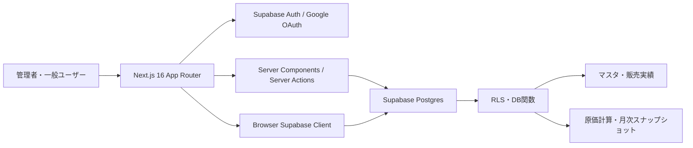
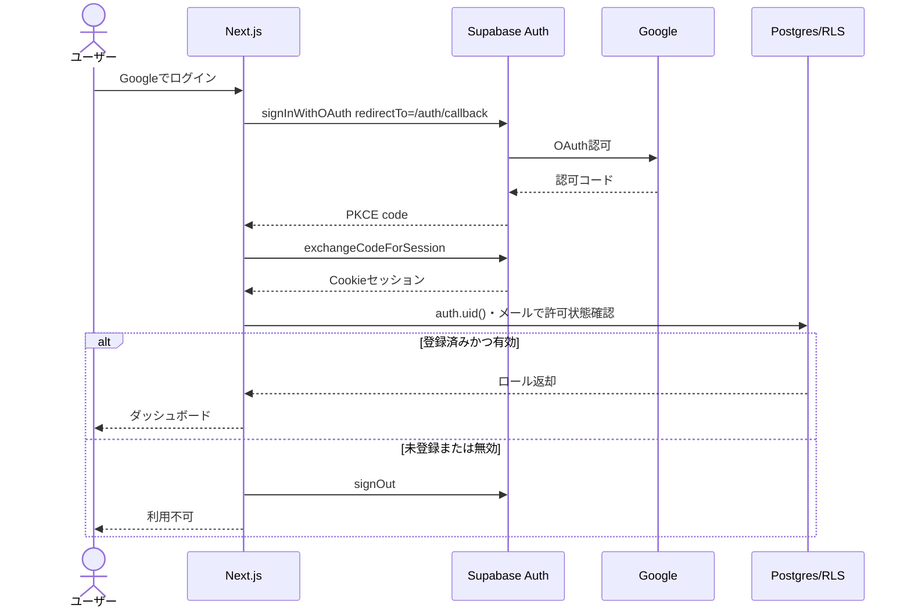
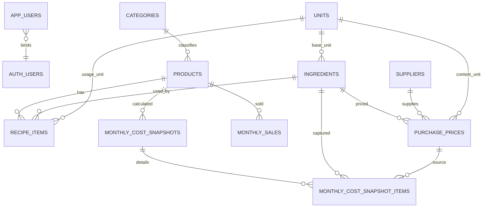

# 原価管理システム システム設計書

- 文書版: 1.0
- 作成日: 2026-08-15
- 入力: `docs/requirements.md` 文書版1.0
- ステータス: 実装可能

## 1. 設計方針

- Next.js 16 App Router、TypeScript、Supabase Postgres/Auth/RLSを使用する。
- ユーザーセッションは`@supabase/ssr`によるCookie方式とし、OAuthはPKCEフローを使用する。
- 読み取りを含む全DBアクセスにRLSを適用し、画面上の非表示だけを認可手段にしない。
- 管理者の通常操作にもPublishable KeyとユーザーJWTを使用する。Secret Key/service role keyは初版アプリで使用しない。
- 月次確定値はスナップショットへ保存し、仕入価格変更で過去値が変わらないようにする。
- 金額・数量はPostgresの`numeric`を使用し、JavaScriptの浮動小数点だけで原価を確定しない。

## 2. システム構成



## 3. 認証・認可設計

### 3.1 Google OAuthフロー



Google側にはSupabaseプロジェクトのcallback URLを登録し、Supabase側のRedirect URLsには開発用`http://localhost:3000/auth/callback`と本番URLを登録する。

### 3.2 許可ユーザー

- `app_users`へ管理者がGoogleメールアドレスを事前登録する。
- 初回ログイン後、同一メールの`auth.users.id`を`app_users.auth_user_id`へ関連付ける。
- メール照合は小文字化した`citext`で行い、Googleの`email_verified`が真であることを前提とする。
- 初期管理者はSupabase SQL Editorから1件登録する。アプリ実装後は管理画面から追加する。
- 認可判定は`is_allowed_user()`と`is_admin()`のDB関数へ集約する。

### 3.3 権限表

| 対象 | 管理者 | 一般 | 未認証・未許可 |
| --- | --- | --- | --- |
| 公開商品・集計 | 読取 | 読取 | 不可 |
| 秘密商品の計算済み原価 | 読取 | 読取 | 不可 |
| 秘密レシピ明細 | 読取 | 不可 | 不可 |
| マスタ・販売実績 | CRUD | 読取 | 不可 |
| ユーザー管理 | CRUD | 不可 | 不可 |
| 月次再計算 | 実行 | 不可 | 不可 |

## 4. DB設計

### 4.1 共通規則

- 主キーは`uuid`、`gen_random_uuid()`を使用する。
- 主要テーブルは`created_at timestamptz`、`updated_at timestamptz`、`created_by uuid`、`updated_by uuid`を持つ。
- マスタは`is_active boolean default true`で論理無効化する。
- `updated_at`は共通triggerで更新する。
- 金額は`numeric(14,4)`、表示時に円単位へ丸める。
- 割合は0以上1未満の`numeric(7,6)`で保持する。

### 4.2 列挙型

| 型 | 値 |
| --- | --- |
| `user_role` | `admin`, `viewer` |
| `unit_dimension` | `mass`, `volume`, `count` |
| `snapshot_status` | `draft`, `confirmed` |

### 4.3 テーブル一覧

#### app_users

| カラム | 型・制約 | 説明 |
| --- | --- | --- |
| id | uuid PK | アプリユーザーID |
| email | citext UNIQUE NOT NULL | 許可Googleメール |
| auth_user_id | uuid UNIQUE NULL, FK auth.users | 初回ログイン後に紐付け |
| display_name | text NOT NULL | 表示名 |
| role | user_role NOT NULL | 管理者／一般 |
| is_active | boolean NOT NULL default true | 利用可否 |
| last_login_at | timestamptz NULL | 最終ログイン |

#### categories

| カラム | 型・制約 | 説明 |
| --- | --- | --- |
| id | uuid PK | カテゴリID |
| name | text UNIQUE NOT NULL | カテゴリ名 |
| sort_order | integer NOT NULL default 0 | 表示順 |
| is_active | boolean NOT NULL default true | 有効状態 |

初期値はタコス、カレー、コーヒー、アルコール、ソフトドリンク。

#### units

| カラム | 型・制約 | 説明 |
| --- | --- | --- |
| id | uuid PK | 単位ID |
| code | text UNIQUE NOT NULL | g、kg、ml、L、piece、bottle、cup等 |
| label | text NOT NULL | 画面表示 |
| dimension | unit_dimension NOT NULL | 次元 |
| to_base_multiplier | numeric(18,6) NOT NULL CHECK > 0 | g/ml/個など基準単位への倍率 |

異なる`dimension`間の変換は許可しない。

#### products

| カラム | 型・制約 | 説明 |
| --- | --- | --- |
| id | uuid PK | 商品ID |
| category_id | uuid FK categories NOT NULL | カテゴリ |
| name | text UNIQUE NOT NULL | 商品名 |
| sale_price_tax_included | numeric(14,4) CHECK >= 0 | 税込販売価格 |
| yield_quantity | numeric(12,4) CHECK > 0 default 20 | 1仕込みの出来上がり数量 |
| hide_recipe | boolean NOT NULL default false | 一般向け秘密レシピ非表示 |
| target_cost_rate | numeric(7,6) NULL CHECK 0<=x<1 | 目標原価率 |
| is_active | boolean NOT NULL default true | 有効状態 |

#### ingredients

| カラム | 型・制約 | 説明 |
| --- | --- | --- |
| id | uuid PK | 材料ID |
| name | text UNIQUE NOT NULL | 材料名 |
| base_unit_id | uuid FK units NOT NULL | 基準単位 |
| loss_rate | numeric(7,6) NOT NULL default 0 CHECK 0<=x<1 | 仕込みロス率 |
| is_active | boolean NOT NULL default true | 有効状態 |

#### suppliers

| カラム | 型・制約 | 説明 |
| --- | --- | --- |
| id | uuid PK | 購入先ID |
| name | text UNIQUE NOT NULL | 購入先名 |
| contact_note | text NULL | 任意メモ |
| is_active | boolean NOT NULL default true | 有効状態 |

#### purchase_prices

| カラム | 型・制約 | 説明 |
| --- | --- | --- |
| id | uuid PK | 仕入価格ID |
| ingredient_id | uuid FK ingredients NOT NULL | 材料 |
| supplier_id | uuid FK suppliers NOT NULL | 購入先 |
| price_tax_included | numeric(14,4) CHECK >= 0 | 1ロット税込価格 |
| order_lot_count | numeric(12,4) CHECK > 0 default 1 | 1回発注時のロット数 |
| content_quantity | numeric(14,6) CHECK > 0 | 1ロット内容量 |
| content_unit_id | uuid FK units NOT NULL | 内容量単位 |
| effective_from | date NOT NULL | 適用開始日 |
| is_active | boolean NOT NULL default true | 有効状態 |

`ingredient_id, supplier_id, effective_from`を一意とする。材料基準単位と内容量単位のdimension一致をtriggerで検証する。

#### recipe_items

| カラム | 型・制約 | 説明 |
| --- | --- | --- |
| id | uuid PK | レシピ明細ID |
| product_id | uuid FK products ON DELETE RESTRICT | 商品 |
| ingredient_id | uuid FK ingredients ON DELETE RESTRICT | 材料 |
| usage_quantity | numeric(14,6) CHECK > 0 | 20人分等1仕込みの使用量 |
| usage_unit_id | uuid FK units NOT NULL | 使用単位 |
| sort_order | integer NOT NULL default 0 | 表示順 |
| note | text NULL | 調合・仕込みメモ（秘密情報を含み得る） |

`product_id, ingredient_id`を一意とし、材料基準単位とのdimension一致をtriggerで検証する。

#### monthly_sales

| カラム | 型・制約 | 説明 |
| --- | --- | --- |
| id | uuid PK | 販売実績ID |
| product_id | uuid FK products NOT NULL | 商品 |
| target_month | date NOT NULL CHECK 月初日 | 対象月 |
| quantity_sold | integer NOT NULL CHECK >= 0 | 販売個数 |

`product_id, target_month`を一意とする。

#### monthly_cost_snapshots

| カラム | 型・制約 | 説明 |
| --- | --- | --- |
| id | uuid PK | スナップショットID |
| product_id | uuid FK products NOT NULL | 商品 |
| target_month | date NOT NULL | 対象月 |
| status | snapshot_status NOT NULL default draft | 確定状態 |
| sale_price | numeric(14,4) NOT NULL | 当月販売価格 |
| yield_quantity | numeric(12,4) NOT NULL | 計算時出来上がり数 |
| batch_cost | numeric(14,6) NOT NULL | 仕込み総原価 |
| unit_cost | numeric(14,6) NOT NULL | 1個原価 |
| quantity_sold | integer NOT NULL | 販売個数 |
| monthly_revenue | numeric(16,4) NOT NULL | 月間売上 |
| monthly_cost | numeric(16,4) NOT NULL | 月間原価 |
| cost_rate | numeric(9,6) NULL | 原価率。売上0はNULL |
| calculated_at | timestamptz NOT NULL | 計算日時 |

`product_id, target_month`を一意とする。`confirmed`は通常の再計算で上書きしない。

#### monthly_cost_snapshot_items

| カラム | 型・制約 | 説明 |
| --- | --- | --- |
| id | uuid PK | 明細ID |
| snapshot_id | uuid FK monthly_cost_snapshots ON DELETE CASCADE | 親 |
| ingredient_id | uuid FK ingredients | 材料 |
| purchase_price_id | uuid FK purchase_prices | 使用価格履歴 |
| ingredient_name | text NOT NULL | 計算時名称 |
| unit_price | numeric(18,8) NOT NULL | 基準単位あたり価格 |
| usage_base_quantity | numeric(18,8) NOT NULL | 基準単位使用量 |
| loss_rate | numeric(7,6) NOT NULL | 計算時ロス率 |
| adjusted_quantity | numeric(18,8) NOT NULL | ロス反映量 |
| ingredient_cost | numeric(14,6) NOT NULL | 材料原価 |

秘密レシピ保護対象。一般ユーザーへ直接SELECTを許可しない。

#### audit_logs

| カラム | 型・制約 | 説明 |
| --- | --- | --- |
| id | bigint generated always as identity PK | ログID |
| actor_user_id | uuid NULL | 操作者 |
| action | text NOT NULL | insert/update/disable/recalculate等 |
| table_name | text NOT NULL | 対象 |
| record_id | uuid NULL | 対象ID |
| changed_fields | jsonb NULL | 秘密値を除く変更項目 |
| created_at | timestamptz NOT NULL | 操作日時 |

### 4.4 ER図



## 5. DB関数・RLS設計

### 5.1 ヘルパー関数

| 関数 | security | 用途 |
| --- | --- | --- |
| `is_allowed_user()` | definer、stable | `auth.uid()`に紐づく有効ユーザー判定 |
| `is_admin()` | definer、stable | 有効管理者判定 |
| `claim_app_user()` | definer | 初回ログイン時、検証済みメールとauth.uidを安全に紐付け |
| `get_visible_recipe(uuid)` | definer | 管理者または非秘密商品のみレシピを返す |
| `recalculate_month(date, boolean)` | definer | 管理者だけが月次原価を計算。確定上書きは明示時のみ |
| `get_monthly_dashboard(date)` | definer | 許可ユーザーへ計算済み集計だけを返す |

`security definer`関数は`set search_path = ''`、完全修飾名、実行権限の明示grant/revokeを必須とする。

### 5.2 RLSポリシー概要

| テーブル | SELECT | INSERT/UPDATE |
| --- | --- | --- |
| app_users | 管理者。本人は自身の公開項目のみ | 管理者のみ |
| categories/products | 許可ユーザー | 管理者のみ |
| units/ingredients/suppliers/purchase_prices | 許可ユーザー | 管理者のみ |
| recipe_items | 管理者のみ直接SELECT | 管理者のみ |
| monthly_sales | 許可ユーザー | 管理者のみ |
| monthly_cost_snapshots | 許可ユーザー | `recalculate_month`のみ |
| monthly_cost_snapshot_items | 管理者のみ | `recalculate_month`のみ |
| audit_logs | 管理者のみ | trigger/安全な関数のみ |

一般ユーザーが公開レシピを見る場合も`get_visible_recipe()`経由とし、秘密商品の場合は0件または権限エラーを返す。未認証向けポリシーは作成しない。

## 6. 原価計算処理

1. 対象月の有効商品と月間販売数を取得する。
2. 各レシピ材料について対象月末時点で`effective_from`が最新の有効仕入価格を選ぶ。
3. 購入内容量とレシピ使用量をそれぞれ基準単位へ変換する。
4. `unit_price = price_tax_included / content_base_quantity`を算出する。
5. `adjusted_quantity = usage_base_quantity / (1 - loss_rate)`を算出する。
6. 材料原価を合計し、出来上がり数量で除して1個原価を算出する。
7. 販売価格・販売数から月間売上と月間原価を算出する。
8. snapshotとsnapshot itemsを同一トランザクションでupsertする。
9. 計算途中は小数第6位以上を保持し、表示時だけ円単位・率小数第1位へ丸める。
10. 仕入価格欠落、単位dimension不一致、出来上がり数量0、ロス率100%以上は計算を中断し、商品別エラーを返す。

## 7. 画面・ルーティング

| Route | 方式 | 主な内容 | 権限 |
| --- | --- | --- | --- |
| `/login` | Client | Googleログイン | 全員 |
| `/auth/callback` | Route Handler | PKCE code交換・許可ユーザー確認 | OAuth戻り |
| `/` | Server + Client chart | 月次ダッシュボード | 許可ユーザー |
| `/products` | Server | 商品一覧 | 許可ユーザー |
| `/products/[id]` | Server | 商品原価・許可されたレシピ | 許可ユーザー |
| `/admin/products` | Server + Actions | 商品・レシピ管理 | 管理者 |
| `/admin/ingredients` | Server + Actions | 材料管理 | 管理者 |
| `/admin/suppliers` | Server + Actions | 購入先・仕入価格管理 | 管理者 |
| `/admin/sales` | Server + Actions | 月次販売個数入力 | 管理者 |
| `/admin/users` | Server + Actions | 許可ユーザー管理 | 管理者 |
| `/admin/settings` | Server + Actions | カテゴリ・単位・目標値 | 管理者 |

Server Componentで初期データと権限を取得し、グラフ、フォーム、月選択など操作部分だけをClient Componentにする。

## 8. Server Actions・Route Handlers

| 名前 | 入力 | 処理 |
| --- | --- | --- |
| `signInWithGoogle` | 戻り先 | OAuth開始 |
| `GET /auth/callback` | code、next | PKCE交換・claim・許可判定 |
| `saveProduct` | 商品フォーム | 管理者検証後upsert |
| `saveRecipe` | 商品ID、材料明細 | transaction/RPCで全明細更新 |
| `saveIngredient` | 材料フォーム | 単位・ロス率検証後upsert |
| `savePurchasePrice` | 仕入価格フォーム | 単位dimension・適用日検証後insert |
| `saveMonthlySales` | 対象月、商品別販売数 | 一括upsert |
| `recalculateMonthlyCosts` | 対象月、上書き可否 | DB関数呼出し |
| `saveAppUser` | メール、表示名、ロール | 管理者だけ登録更新 |

入力はZodでサーバー側検証し、Supabaseエラーを利用者向け文言へ変換する。公開APIは追加せず、外部連携が必要になった時点でRoute Handlerを設計する。

## 9. ディレクトリ構成

```text
src/
  app/
    (auth)/login/page.tsx
    auth/callback/route.ts
    (dashboard)/layout.tsx
    (dashboard)/page.tsx
    (dashboard)/products/page.tsx
    (dashboard)/products/[id]/page.tsx
    admin/products/page.tsx
    admin/ingredients/page.tsx
    admin/suppliers/page.tsx
    admin/sales/page.tsx
    admin/users/page.tsx
    admin/settings/page.tsx
  components/
    dashboard/
    forms/
    layout/
    ui/
  features/
    auth/actions.ts
    products/actions.ts
    ingredients/actions.ts
    purchases/actions.ts
    sales/actions.ts
    users/actions.ts
  lib/
    auth/authorization.ts
    supabase/client.ts
    supabase/server.ts
    supabase/proxy.ts
    validation/
  types/database.types.ts
supabase/
  migrations/
    0001_extensions_enums.sql
    0002_core_tables.sql
    0003_cost_tables.sql
    0004_functions.sql
    0005_rls.sql
    0006_seed_master.sql
  tests/database/
docs/
```

## 10. マイグレーション・実装順序

1. 拡張`citext`、列挙型、単位・カテゴリ・ユーザーを作成する。
2. 商品、材料、購入先、仕入価格、レシピ、販売実績を作成する。
3. 月次スナップショット、監査ログを作成する。
4. 認可ヘルパー、原価計算、可視レシピ、ダッシュボード関数を作成する。
5. 全テーブルでRLSを有効化し、未認証を拒否してから必要最小限のpolicyを追加する。
6. 単位・カテゴリの初期データを投入する。
7. DBテストで管理者、一般、未許可、未認証を検証する。
8. Next.js SSRクライアント、proxy、OAuth callback、ログイン画面を実装する。
9. 管理画面をマスタ依存順に実装する。
10. 販売実績、再計算、ダッシュボードを実データへ接続する。

各マイグレーションは新規追加方式とし、適用済みファイルを書き換えない。破壊的変更はバックアップと移行SQLを用意する。

## 11. セキュリティ注意事項

- Publishable Keyは公開可能だが、RLS無効テーブルを作らない。
- Secret Key、service role key、Google Client SecretはNext.jsの`NEXT_PUBLIC_`変数へ入れない。
- `user_metadata`を権限判定に使わず、`app_users`と`auth.uid()`を正とする。
- OAuthの`next`は相対パスだけを許可し、オープンリダイレクトを防ぐ。
- 一般ユーザー向けレスポンスにsnapshot items、材料名、使用量、noteを含めない。
- audit logへ秘密レシピの値や環境変数を保存しない。
- Public GitHubには実レシピ、実ユーザー一覧、`.env.local`をコミットしない。

## 12. 要件トレーサビリティ

| 要件 | 設計要素 |
| --- | --- |
| M-01〜M-03 | Supabase Auth、app_users、PKCE callback、認可関数 |
| M-04〜M-07 | products、ingredients、suppliers、purchase_prices、recipe_items |
| M-08 | hide_recipe、get_visible_recipe、recipe_items RLS |
| M-09 | monthly_sales、管理Server Action |
| M-10 | recalculate_month、snapshot tables |
| M-11〜M-12 | get_monthly_dashboard、dashboard routes/components |
| M-13 | app_users、管理画面、RLS |
| M-14 | 全テーブルRLS、is_allowed_user、is_admin |
| M-15 | 共通監査列、audit_logs |

## 13. 設計検証チェック

- 画面・DB・権限・計算式をMust要件へ対応付け済み。
- 秘密レシピは一般ユーザーの直接SELECTを禁止し、安全なDB関数だけで公開可否を判定する。
- Secret Key/service role keyなしで通常運用できる。
- 月次原価と内訳をスナップショットとして再現できる。
- マイグレーションと実装順序を定義済み。

## 【次のAIへの引き継ぎ事項】

- 最初にDBマイグレーション0001〜0006とRLSテストを実装する。
- 初期管理者メールは実装開始前にユーザーから取得し、Public Gitへ値を含めずSupabase SQL Editorで投入する手順とする。
- `@supabase/ssr`のCookie client、proxy、PKCE callbackは公式Next.js向け手順に合わせる。
- DB型はSupabase CLIで生成し、手書き型との乖離を避ける。
- 管理画面より先にRLSを完成させ、一般ユーザーの秘密レシピ取得不可を自動テストする。
